# IaCパイプラインの構成

## 1. サービスプリンシパルとセキュリティグループの準備

### 1-1. DevOps用サービスプリンシパルの作成

1. [アプリの登録](https://docs.microsoft.com/ja-jp/power-bi/developer/embedded/embed-service-principal#step-1---create-an-azure-ad-app)を実施します。
2. 以下の情報をメモします。

- アプリケーション (クライアント) ID 
- ディレクトリ (テナント) ID
- クライアント シークレットの値

### 1-2. 権限付与

1. [Azure portal を使用して Azure ロールを割り当てる](https://docs.microsoft.com/ja-jp/azure/role-based-access-control/role-assignments-portal?tabs=current)を参考に、作成したサービスプリンシパルを対象のリソースグループの所有者に設定します。

### 1-3. セキュリティグループの作成

1. [基本グループを作成してメンバーを追加する](https://docs.microsoft.com/ja-jp/azure/active-directory/fundamentals/active-directory-groups-create-azure-portal#create-a-basic-group-and-add-members) を参考に、以下のメンバーを追加します。
    1. 自分自身および、Synapse Workspace上での開発者
    2. 1-1で作成した、DevOps用のサービスプリンシパル 

このセキュリティグループは、DataLakeや、KeyVaultの利用権限のほか、以下の権限が付与されます
   - Synapse Workspaceへの成果物のデプロイのためのSynapse管理者権限
   - SQL PoolデプロイのためのSQL AD管理者
    
2. グループ名称とオブジェクトIDを確認し、メモします。この値は後ほど利用します。

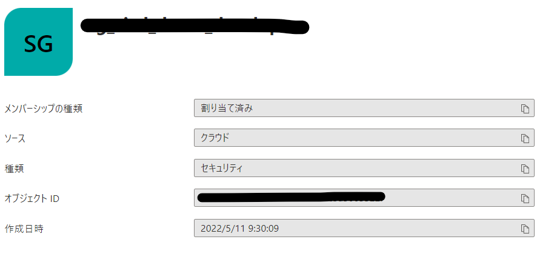

## 2. DevOps環境の作成

### 2-1. サインアップ

[Azure DevOpsにサインインする](https://docs.microsoft.com/ja-jp/azure/devops/user-guide/sign-up-invite-teammates?view=azure-devops)に従って、プロジェクトを作成します。

### 2-2. Repositryのインポート

参考：[Git リポジトリをインポートする](https://docs.microsoft.com/ja-jp/azure/devops/repos/git/import-git-repository?view=azure-devops#import-into-a-new-repo)

1. **Repos**->**Files**->**Import**の順にクリックします

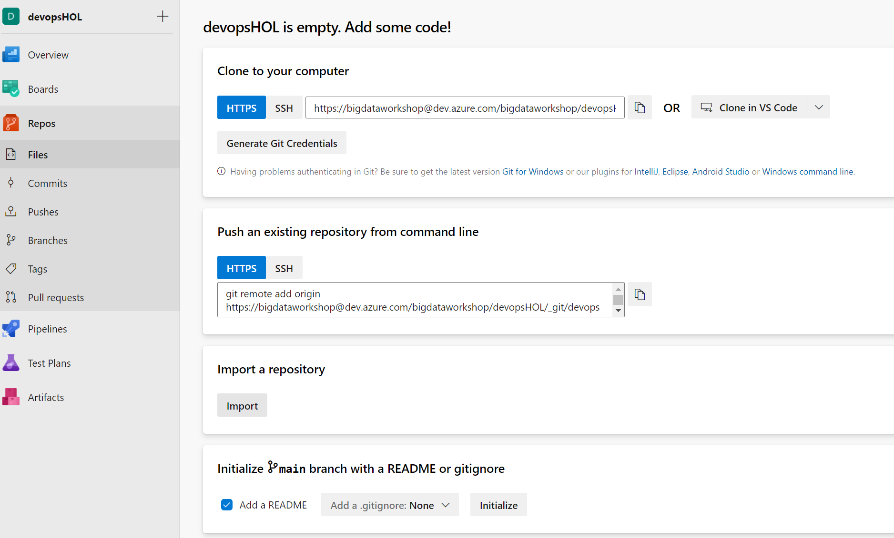

2.  **https://github.com/ryoma-nagata/SynapseCICD-HOL.git** を入力して、**Import**をクリックします。

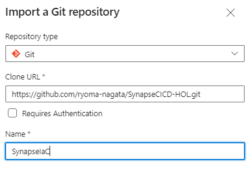

3. リポジトリがインポートされていることを確認します。

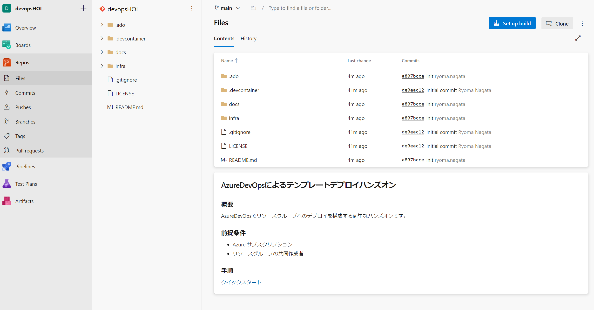

### 2-3. サービス接続の作成

1. **Project setting**に移動します。

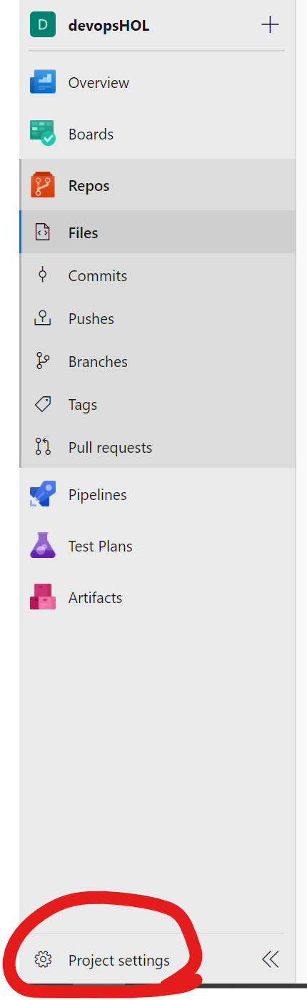

2. **Service connections**->**Create service connection**の順にクリックします。

[参考](https://docs.microsoft.com/ja-jp/azure/devops/pipelines/library/service-endpoints?view=azure-devops&tabs=yaml#create-a-service-connection)

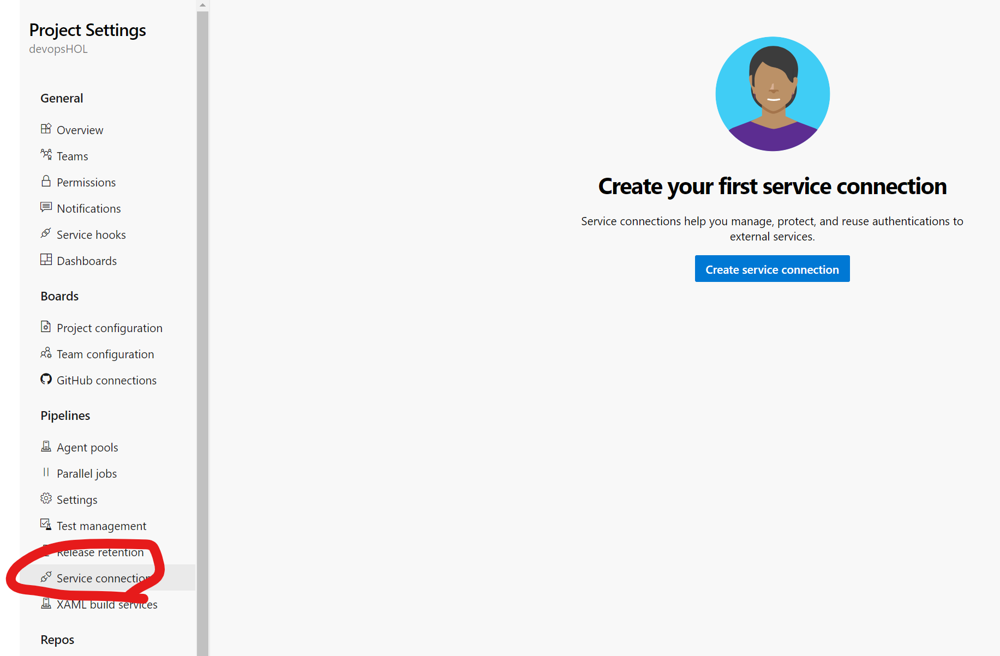

3. **Azure Resource Manager**を選択します。

4. **Service principal(manual)**を選択します。

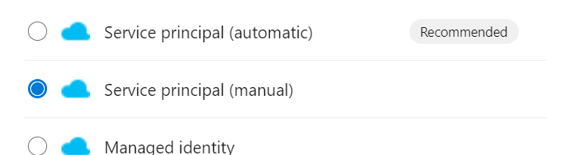

5. 各項目を入力のうえ、**name**には**azure-devops-service-connection**と入力します。

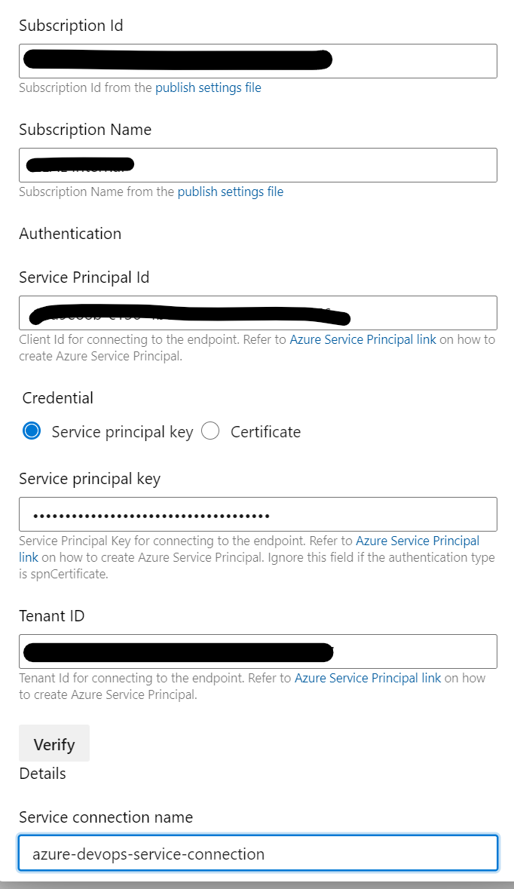

6. **Grant access permission to all pipelines**にチェックをつけて**Verify and save**をクリックします。

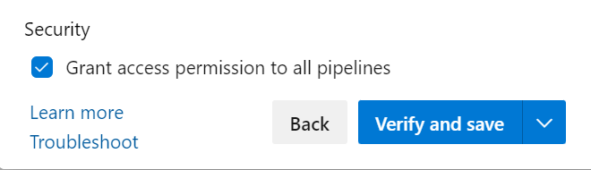

### 2-4. DevOps Environment の作成

1. **Pipelines**->**Environments**->**New environment**の順にクリックします

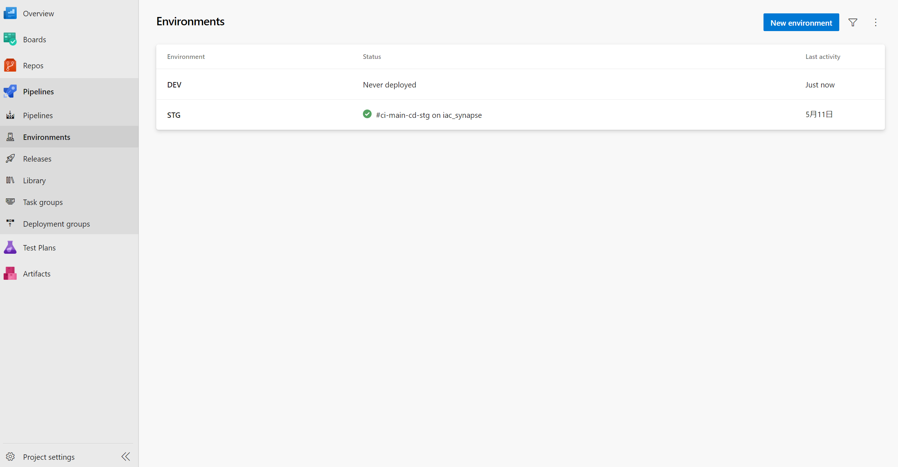

2. DEVおよびSTGを作成します。（画像はDEV）

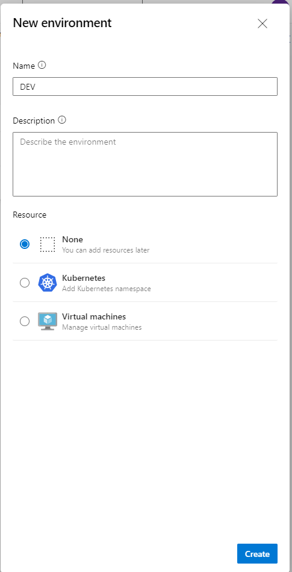

## 3. DevOpsパイプラインの実行

### 3-1. パイプライン定義の編集

1. [.ado/workflows/azure-pipelines.yml](.ado/workflows/azure-pipelines.yml)を開き、**edit**にて以下の変数を設定します。

- AZURE_SUBSCRIPTION_ID：サブスクリプションID
- RESOURCE_GROUP_NAME_DEV：DEV環境用リソースグループの名称
- RESOURCE_GROUP_NAME_STG：STG環境用リソースグループの名称（DEVと同一可能

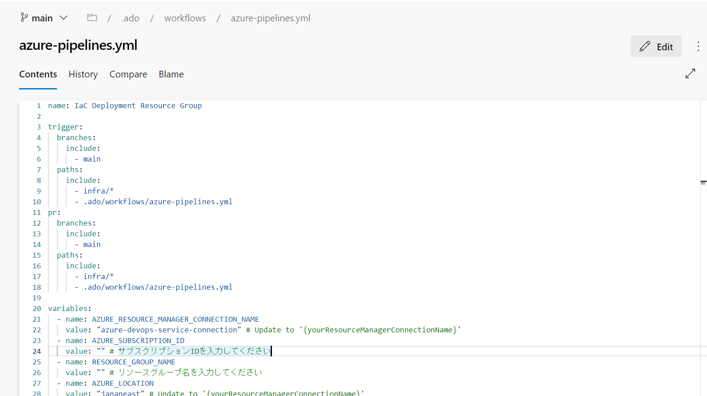

2. 編集後、**commit**します

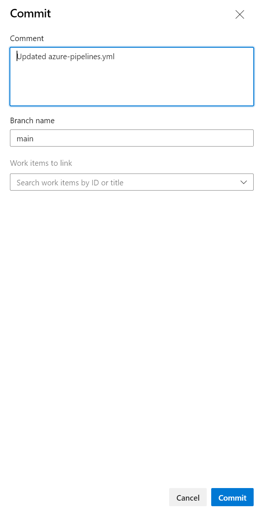

### 3-2. テンプレートパラメータの編集

1. [params_dev.json](infra/../../infra/params_dev.json)を開き、以下の項目を編集します。

| パラメータ               | 説明                                          |
|---------------------|---------------------------------------------|
| location            | リソースのデプロイリージョン                              |
| project             | 6文字程度を推奨。リソース名はproject-deployment_id-リソース種類-envとなります |
| env                 | **dev**を入力 |
| deployment_id       | リソース名はproject-deployment_id-リソース種類-envとなります |
| storageIPWhiteLists | 許可したいIPリスト                                  |
| sqlIPWhiteLists     | 許可したいIPリスト                                  |
| AdminGroupName      | 1-3.で作成したセキュリティグループの名称を入力すると自動で権限が付与されます             |
| AdminGroupObjectID  | 1-3.で作成したセキュリティグループのオブジェクトIDを入力すると自動で権限が付与されます       |
| sqlPoolBackupType   | SQLPoolのバックアップタイプ 。たとえばSTG環境ではGRSにします。                         |
| sqlPooldwu          | SQLPoolの性能SKU。たとえばSTG環境では200DWUにします。                                   |

2. [params_stg.json](infra/../../infra/params_stg.json)を開き、以下の項目を編集します。

| パラメータ               | 説明                                          |
|---------------------|---------------------------------------------|
| location            | リソースのデプロイリージョン                              |
| project             | 6文字程度を推奨。リソース名はproject-deployment_id-リソース種類-envとなります |
| env                 | **stg**を入力 |
| deployment_id       | リソース名はproject-deployment_id-リソース種類-envとなります |
| storageIPWhiteLists | 許可したいIPリスト                                  |
| sqlIPWhiteLists     | 許可したいIPリスト                                  |
| AdminGroupName      | 1-3.で作成したセキュリティグループの名称を入力すると自動で権限が付与されます             |
| AdminGroupObjectID  | 1-3.で作成したセキュリティグループのオブジェクトIDを入力すると自動で権限が付与されます       |
| sqlPoolBackupType   | SQLPoolのバックアップタイプ 。たとえばSTG環境ではGRSにします。                         |
| sqlPooldwu          | SQLPoolの性能SKU。たとえばSTG環境では200DWUにします。                                   |

### 3-3. パイプラインの読み込みと実行

1. **Pipelines**->**Pipelines**->**Create Pipeline**の順にクリックします

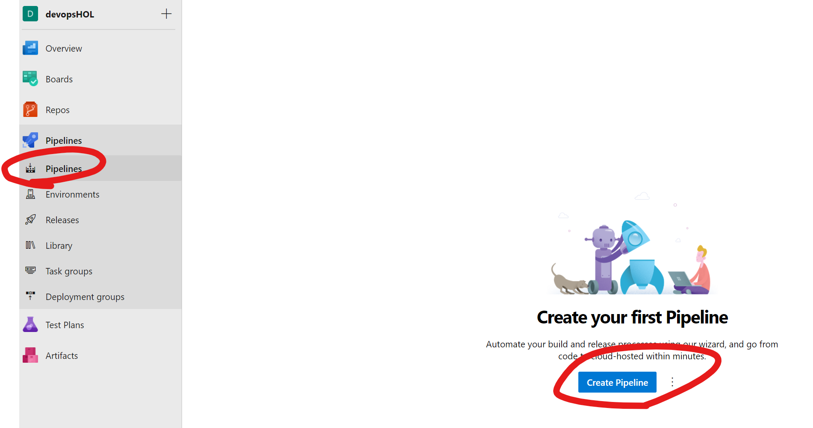

2. **Azure Repos git**を選択します。

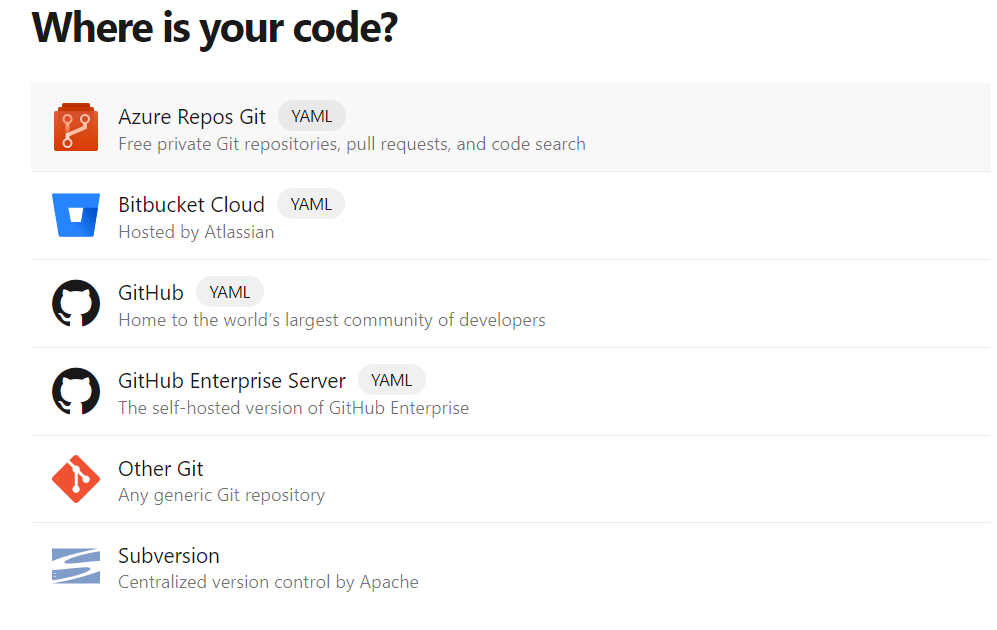

3. 対象のリポジトリを選択後、**Existing Azure Pipeline YAML file**を選択します。

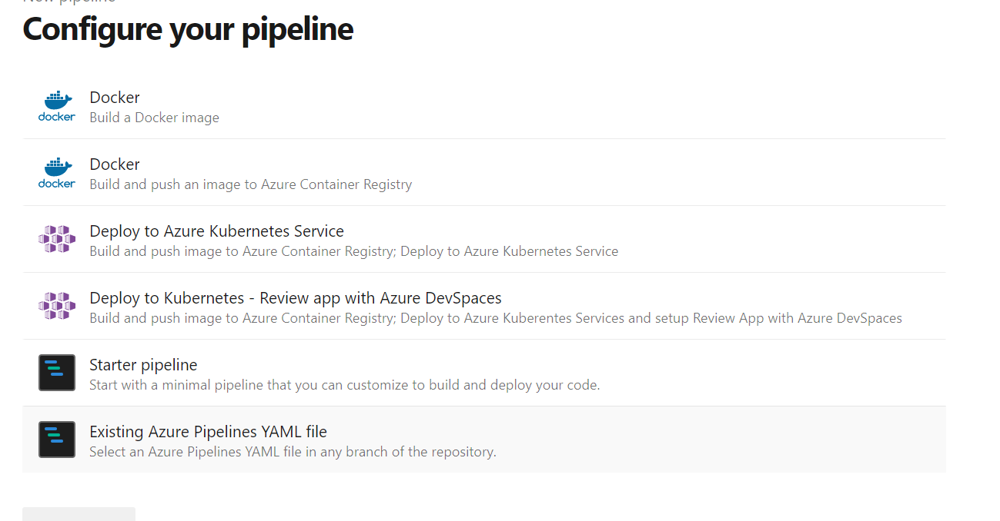

4. **/.ado/workflows/azure-pipelines.yml**を選択します。

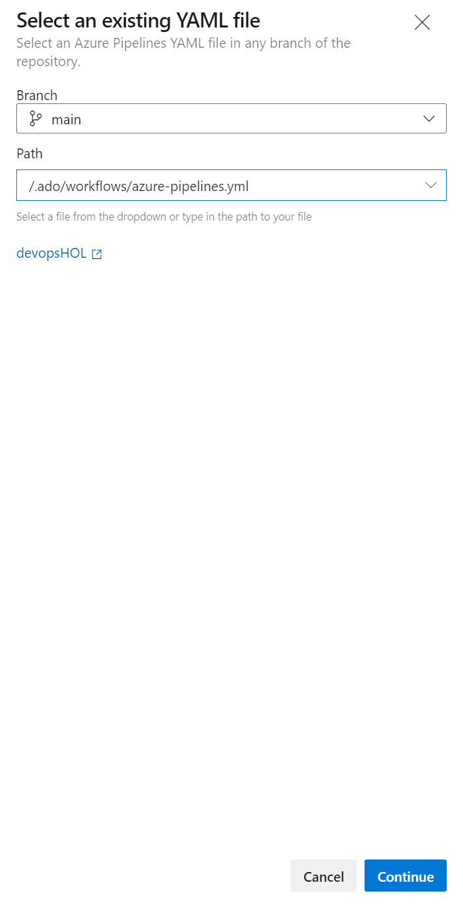

5. **Run**をクリックします

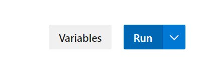

6. 画面でパイプラインへの権限付与のメッセージが出たら適宜許可してください。

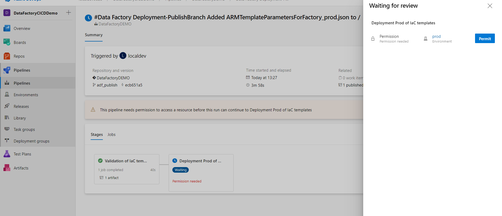

7. 対象のリソースグループの**デプロイ**画面から実行を確認可能です。（20分ほどかかる場合があります。）

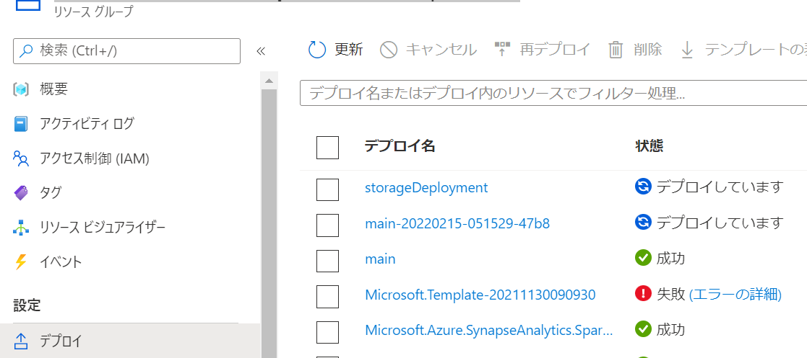

## 4. Synapse RBACロールの付与

### 4-1. Synapse RBACロールの付与

1. [Synapse Studio で Synapse RBAC ロールの割り当てを管理する方法](https://docs.microsoft.com/ja-jp/azure/synapse-analytics/security/how-to-manage-synapse-rbac-role-assignments#open-synapse-studio) を参考に、dev,stg環境それぞれで1-3で作成したセキュリティグループへのSynapse管理者権限の付与を実行します。

## 次のステップ

[Synapse SQL Poolおよびworkspace成果物のCICDパイプライン構成](2_Setup_SynapseCICD.md)