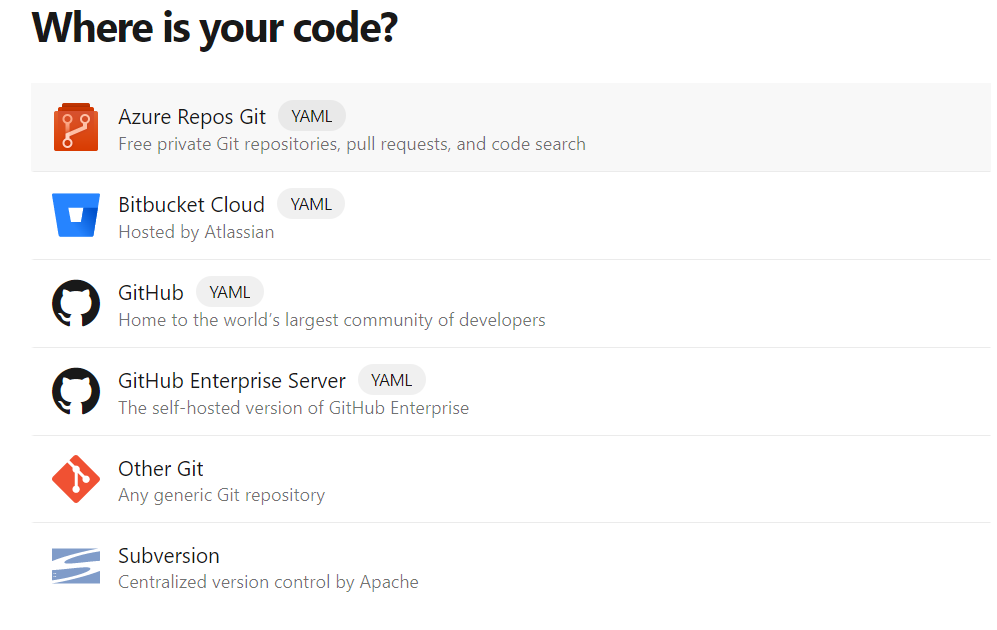
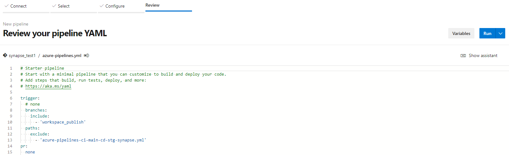

# Synapse SQL Poolおよびworkspace成果物のCICDパイプライン構成

## 準備

DEV,STG双方のSQL Poolが起動中であることを確認します。画像のように停止している場合は、起動してから作業してください。

## 1. Synapse 成果物デプロイパイプラインのセットアップ

### 1-1. Synapse workspace 用リポジトリの作成

1. [Web ポータルを使用してリポジトリを作成する](https://docs.microsoft.com/ja-jp/azure/devops/repos/git/create-new-repo?view=azure-devops#create-a-repo-using-the-web-portal) を参考にDevOps プロジェクト内で新規リポジトリを作成します。

### 1-2. Synapse workspace git構成

1. [https://web.azuresynapse.net/](https://web.azuresynapse.net/) からdev用のsynapseに移動します。
   
2. [Azure DevOps Git に接続する](https://docs.microsoft.com/ja-jp/azure/synapse-analytics/cicd/source-control#connect-with-azure-devops-git) を参考に、作成したリポジトリに接続します。

### 1.3. 発行ブランチの準備

1. Synapse Studio上で**発行** ボタンをクリックします。確認画面が出たら **OK** をクリックします。

2. テンプレート生成の完了を確認します。

3. DevOpsに戻り、Synapse用のリポジトリから **workspace_publish** に切り替えます。

4. 以前にインポートした、IaC用のリポジトリから[.ado/synapse/azure-pipelines.yml](.ado/synapse/azure-pipelines.yml)をダウンロードし、 **workspace_publish** にアップします。

5. DEV Synapse用のテンプレートパラメータファイルである、**TemplateParametersForWorkspace.json** をRenameし、名称を **TemplateParametersForWorkspace_stg.json** に変更します。このファイルがSTG環境用のパラメータファイルとなります。

6. リネームしたファイルを編集し、workspaceNameのvalue部分をSTG Synapseリソース名に変更します。
 

### 1-4. パイプライン定義の編集

1. [.ado/synapse/azure-pipelines.yml](.ado/synapse/azure-pipelines.yml)を開き、**edit**にて以下の変数を設定します。

  - SOURCE_WORKSPACE_NAME : DEVのsynapseリソース名
  - TARGET_WORKSPACE_NAME_STG : STGのsynapseリソース名
  - TARGET_RESOURCE_GROUP_NAME_STG : STGのsynapseリソースの存在するリソースグループ名

2. 編集後、**commit**します

### 1-5. パイプラインの読み込みと実行

1. **Pipelines**->**Pipelines**->**Create Pipeline**の順にクリックします

2. **Azure Repos git**を選択します。

3. synapse用のリポジトリを選択後、**Existing Azure Pipeline YAML file**を選択します。

4. **workspace_publish** 内の **/azure-pipelines.yml**を選択します。

5. **Run**をクリックします

6. 画面でパイプラインへの権限付与のメッセージが出たら適宜許可してください。

**注意：**

このパイプラインでは、デプロイのためにすべてのトリガーを無効化したあと、すべて有効化にする設定が構成されています。変更の場合はpipeline定義から該当箇所をコメントアウトしてください

## 2. SQL Poolデプロイパイプラインのセットアップ

### 2-1. SQL Pool用リポジトリの設定

1. [「Git リポジトリをインポートする」](https://docs.microsoft.com/ja-jp/azure/devops/repos/git/import-git-repository?view=azure-devops#import-into-a-new-repo) を参考に、 https://github.com/ryoma-nagata/SynapseCICD-HOL-SqlPool.git をインポートします。

2. インポートしたリポジトリ内の[.ado/workflows/azure-pipelines.yml](.ado/sql/azure-pipelines.yml)を開き、**edit**にて以下の変数を設定、Commitします。

- TARGET_WORKSPACE_NAME_STG: STG Synapseのリソース名

### 2-2. パイプラインの構成

1. **Pipelines**->**Pipelines**->**Create Pipeline**の順にクリックします

3. **Azure Repos git**を選択します。

4. インポートしたリポジトリを選択後、**Existing Azure Pipeline YAML file**を選択します。

5. **/.ado/workflows/azure-pipelines.yml**を選択します。

6. **Run**をクリックします

## 次のステップ

[Synapse SQL PoolおよびPipelinesのCICD](3_Dev_SynapseCICD.md)