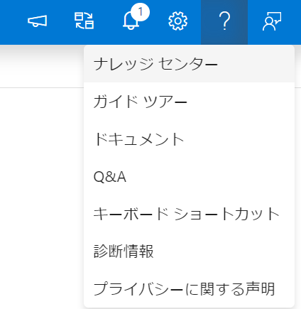

# Synapse SQL PoolおよびPipelinesのCICD

## 1. SQL Poolのテーブルの追加

1. sql pool 用のリポジトリをcloneし、sql.slnを開きます。


2. ソリューションエクスプローラから 右クリック>追加>テーブルを選択肢、 **taxi-green** テーブルを追加します。


3. [taxi-green](../sample/taxi-green.sql)の内容をコピーペーストして保存します


4. ビルド>sqlの公開 をクリックします。


5. 接続先を編集します。


6. 参照タブで接続先を入力し、DEV Synapse sqlpoolに接続します。


7. 公開をクリックし、配置の成功を確認します。


8. commit およびpushにより自動でSTG環境に反映されます。 


## 2. Synapse リンクサービスの追加

### 2-1. Key Vaultリンクサービスの作成

1. DEV Synapse上で、Keyvaultリンクサービスを作成します。


2. MSI認証にして接続確認、コミットします。


### 2-2. Green Taxi リンクサービスの作成

1. ナレッジセンターにアクセスします。




2. green taxiデータセットを選択、追加します。


3. 自動作成されたリンクサービスを開きます。


4. SAS URLを **https://azureopendatastorage.blob.core.windows.net/nyctlc/green?''** に置き換えます。


## 3. Synapse パイプラインテンプレートのインポート

1. パイプライン画面で **パイプラインテンプレートからインポートする** を選択します。


2. [master_nyc.zip](../sample/master_nyc.zip) をダウンロードし、選択します。リンクサービスの選択は表示されるものを選択します。


3. デバッグ実行し、正常終了を確認します。


4. **nyc_ingest_raw** からデバッグ用のフィルタ処理を外します。


5. コミット、発行します。
   


6. workspace_publishの変更を検知して、パイプラインが起動します。


7. STG Synapseのリンクサービスを確認し、接続できないことを確認します。これはパラメータファイルが構成されていないためです。


8. DEvOpsに戻り、**TemplateParametersForWorkspace.json** を確認します。
**TemplateParametersForWorkspace_stg.json**　に比べて、リンクサービス情報が追加されていることがわかります。


9.  **TemplateParametersForWorkspace_stg.json** を以下のように編集しコミットします。既存のリンクサービスは影響なしとなるので任意で入力

- workspaceName:stg環境のsynapseリソース名
- AzureKeyVault_properties_typeProperties_baseUrl：KeyVaultリソース名をstg環境のものに置き換え
- nyc_tlc_green_sasUri：https://azureopendatastorage.blob.core.windows.net/nyctlc/yellow?'' とする

```json

{
	"$schema": "https://schema.management.azure.com/schemas/2015-01-01/deploymentParameters.json#",
	"contentVersion": "1.0.0.0",
	"parameters": {
		"workspaceName": {
			"value": "sycicd-t2-syn-stg"
		},
		"sycicd-t2-syn-dev-WorkspaceDefaultSqlServer_connectionString": {
			"value": ""
		},
		"AzureKeyVault_properties_typeProperties_baseUrl": {
			"value": "https://<keyvaultリソース名>-stg.vault.azure.net/"
		},
		"nyc_tlc_green_sasUri": {
			"value": "https://azureopendatastorage.blob.core.windows.net/nyctlc/yellow?''"
		},
		"sycicd-t2-syn-dev-WorkspaceDefaultStorage_properties_typeProperties_url": {
			"value": ""
		}
	}
}

```

10. 再度Synapse用のCICDパイプラインが実行されるので、STG Synapseのリンクサービスを確認し、想定の値が入力されていることを確認できます。

